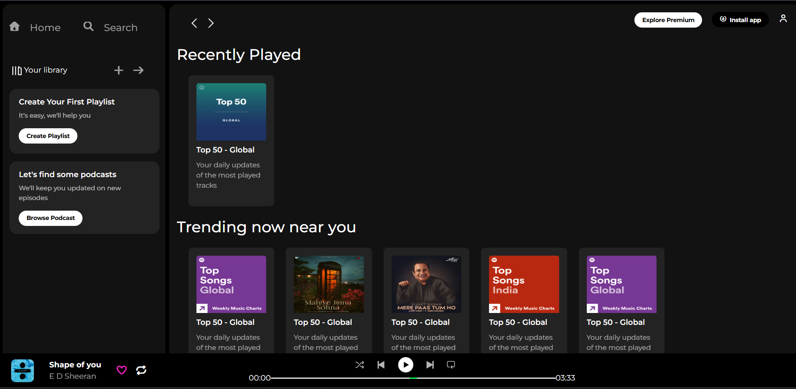
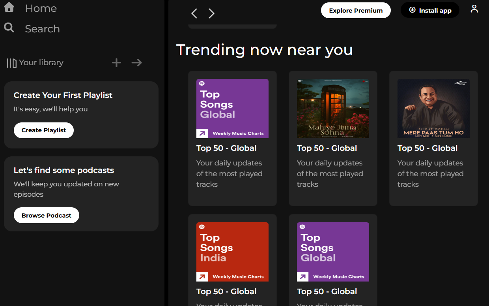

# 🎵 Spotify Clone (Frontend)

A **Spotify landing page clone** built using **HTML & CSS**, focusing on a clean layout and interactive design.  
This project replicates the Spotify web player interface and includes hover effects for a better user experience.

---

## ✨ Features
- **Spotify-like UI** with sidebar, playlist section, and trending music grid  
- **Hover effects** on cards for a smooth interactive feel  
- **Responsive layout** using `rem` units instead of `px` for better scalability  
- Minimal and clean dark theme design  

---

## 🛠 Tech Stack
- **HTML5** – structure  
- **CSS3** – styling (with `rem` units for responsiveness)

---

## 🎯 Purpose
This project was created to:
- Practice building a **music app UI layout**
- Improve responsive design skills
- Experiment with **hover effects** and interactive UI elements

---

## 📸 Screenshot

---
